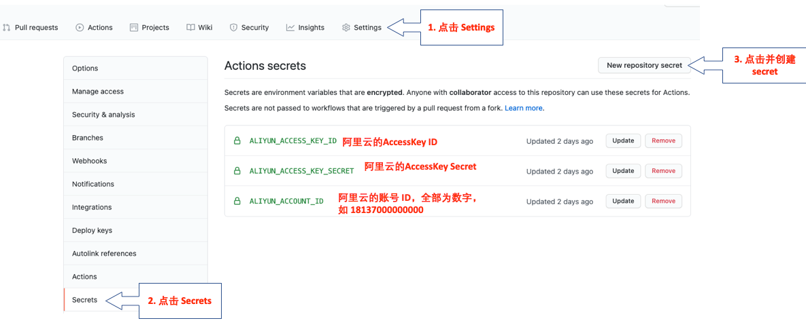

Serverless Devs Astro template
===============================

使用Serverless Devs快速部署Jamstack站点。

# 如何使用?

点击仓库右上角的"Use this template"绿色按钮，创建你自己的Astro项目。

# 如何设置阿里云账号信息

项目创建完毕后，你需要设置一下Github Actions信息，这样可以将你的Astro站点自动部署到阿里云Serverless平台上。 请点击 [Actions secrets](../../settings/secrets/actions)，然后进行如下设置：

其中的 ALIYUN_ACCOUNT_ID 你登录阿里云后，鼠标移动到你头像上就可以查看到，就是那串长数字。为了安全的需要， 我们建议您创建一个Jamstack子账号，然后使用该子账号的Access Key用于Jamstack站点的部署。

# 编辑s.yaml

回到应用仓库页面，按下"."键，调用出Github Codespace，然后打开`s.yaml`文件，将 `x.resume.net.cn`的域名替换为 `xxx.resume.net.cn` 样式， 其中的`xxx`是你在Serverless平时上的项目子域名。 你可以使用 `curl -I https://xxxx.resume.net.cn` 判断域名是否已经被占用。

# 编辑发布

在Codespace中编辑你站点的文件，修改commit后，会自动触发Github Actions集成，完成站点的自动发布。

# References

* Astro: https://astro.build/
* Serverless Devs: https://www.serverless-devs.com/
